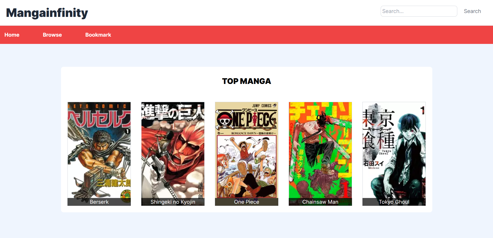
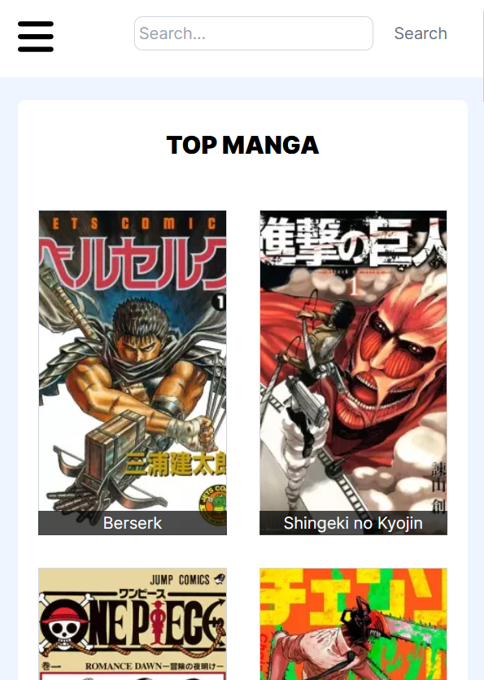

# Manga Infinity

## Description
Manga Infinity is a web application built with React. It uses the Jikan API to fetch and display manga information. The application is designed to provide users with a comprehensive platform to browse, search, and bookmark their favorite manga.

## Features
1. **Browse Manga**: Users can browse through a list of manga. The list can be sorted and filtered based on different criteria such as genre, popularity, and recency.
2. **Search Manga**: Users can search for specific manga using the search bar.
3. **Manga Details**: Clicking on a manga will display detailed information about it, including its synopsis, author(s), and genre(s).
4. **Bookmark Manga**: Users can bookmark their favorite manga for easy access later. The bookmarked manga are stored in a Redux store.
5. **Responsive Design**: The application is designed to be responsive and works well on both desktop and mobile devices.

## Screenshots

  

  

## How to run

1. git clone git@github.com:johnEdmon44/manga-infinity.git
2. npm install
3. npm run dev