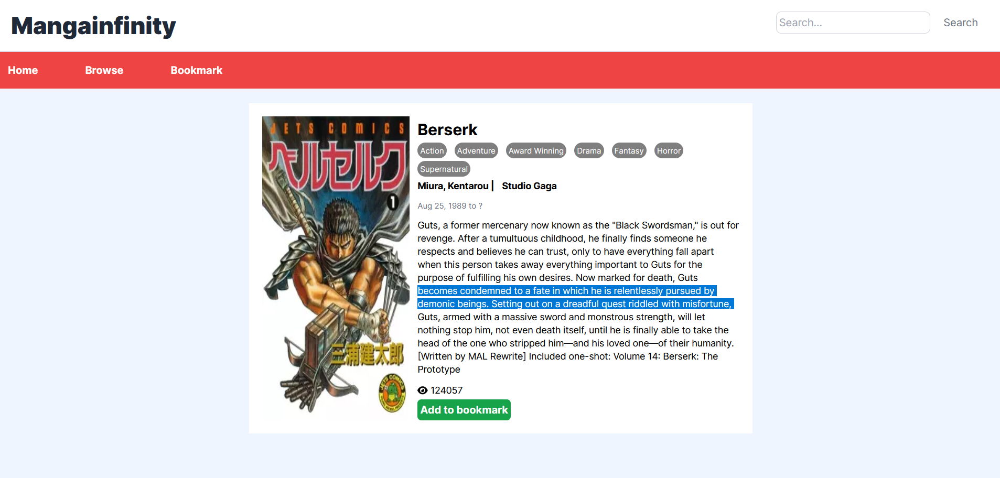

# Manga Infinity

## Description
Manga Infinity is a web application built with React. It uses the Jikan API to fetch and display manga information. The application is designed to provide users with a comprehensive platform to browse, search, and bookmark their favorite manga.

## Table of Contents

- [Features](#features)
- [Demo](#demo)
- [Screenshots](#screenshots)
- [Getting Started](#getting-started)

## Features

1. **Browse Manga**: Users can browse through a list of manga. The list can be sorted and filtered based on different criteria such as genre, popularity, and recency.
2. **Search Manga**: Users can search for specific manga using the search bar.
3. **Manga Details**: Clicking on a manga will display detailed information about it, including its synopsis, author(s), and genre(s).
4. **Bookmark Manga**: Users can bookmark their favorite manga for easy access later. The bookmarked manga are stored in a Redux store.
5. **Responsive Design**: The application is designed to be responsive and works well on both desktop and mobile devices.

## Demo

You can see a live demo of the Manga browser application [here](https://glittery-dasik-7ebf2d.netlify.app/)

## Screenshots

  

  

  

## Getting Started

To run the Shopping Cart application locally, follow these steps:

1. Clone this repository to your local machine or download the source code files.
2. Open the terminal and navigate to the project directory.
3. Run the command `npm install` to install the required dependencies.
4. Run the command `npm run dev` to start the development server.
5. Open your preferred web browser and visit `http://localhost:5173/` to access the application.